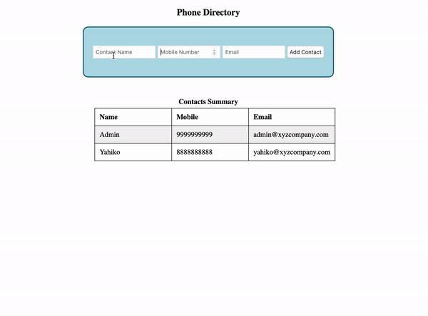

# Phone Directory

**Phone Directory:**

- Phone Directory is a web application that allows a user to manage contacts.

- **Once a contact is saved, it appears in a table.**

- **The list can be sorted by name.**

**Functionality:**

- It has three fields Name, Mobile and Email. All 3 are required fields.
- Clicking on the Add Contact button should add the contact to the table.
- Before adding a contact, the following validations should occur:

  - _Name_ - Should contain only Alphabets and Space. Should be less than or equal to 20 characters in length.
  - _Mobile_ - Should contain only Numbers.Should be equal to 10 characters in length.
  - _Email_ - Should have a proper validation and should be less than 40 characters in length.

- Show an error div with id 'error' if there is any error in input format or if there is any empty field.
- Valid contacts should get added sequentially in the table.
- After adding a valid contact, all fields should be reset to empty.
- Clicking on the _Name_ heading in the table should sort it by ascending order of the contact name. Further clicks should alternately sort descending then ascending.
- Odd numbered data rows should have #f2f2f2 as the background color. Exclude <th>.

There is an initial row with a sample contact. The data for that row resides in the window.contactsList variable. This data should remain in the contact List.

**NOTE:**

- No modifications should be made to the HTML template.

**DEMO:**

