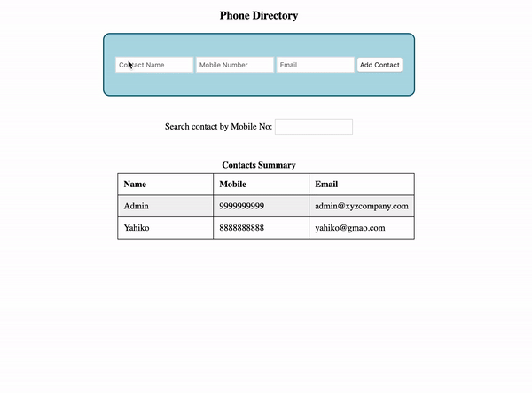

# Phone Directory

**Phone Directory:**

- Phone Directory is a web application that allows a user to manage contacts.

- **Once a contact is saved, it appears in a table.**

- **The list can be sorted by name.**

- **The list can be filtered by phone number.**

**Functionality:**

- It has three fields _Name, Mobile_ and _Email_. All 3 are required fields.
- Clicking on the _Add Contact_ button should add the contact to the table.
- Before adding a contact, the following validations should occur:
  - _Name_ - Should contain only Alphabets and Space. Should be less than or equal to 20 characters in length.
  - _Mobile_ - Should contain only Numbers.Should be equal to 10 characters in length.
  - _Email_ - Should have a proper validation and should be less than 40 characters in length.
- Show an error div with id 'error' if there is any error in input format or if there is any empty field.
- Valid contacts should get added sequentially in the table.
- After adding a valid contact, all fields should be reset to empty.
- Clicking on the Name heading in the table should sort it by ascending order of the contact name. Further clicks should alternately sort descending then ascending.
- The search should begin as soon as an input is typed by the user in the search field. It should filter rows based on the mobile number given in the search field.
- If there is no matching row for the search term, then the div with id 'noResult' should be made visible. It should be hidden otherwise.
- Odd numbered data rows should have #f2f2f2 as the background color. Exclude <th>.

There is an initial row with a sample contact. The data for that row resides in the window.contactsList variable. This data should remain in the contact List.

**NOTE:**

- No modifications should be made to the HTML template.

